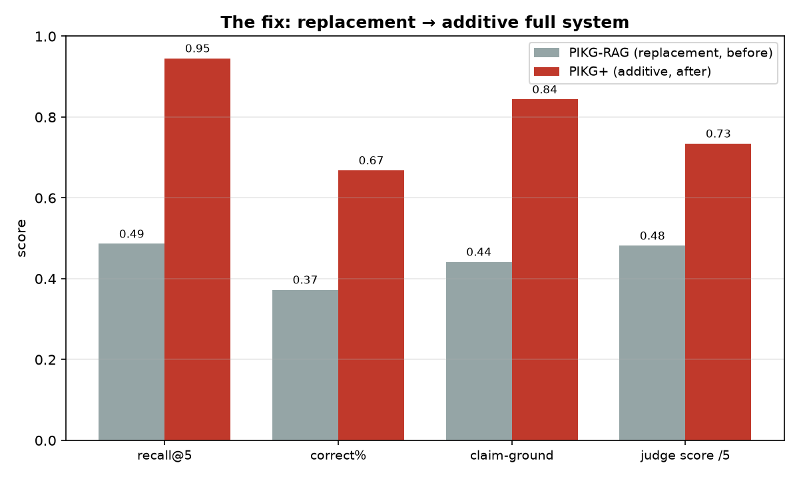
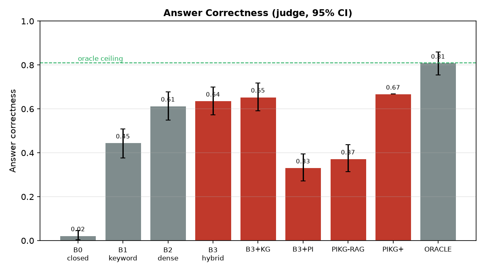
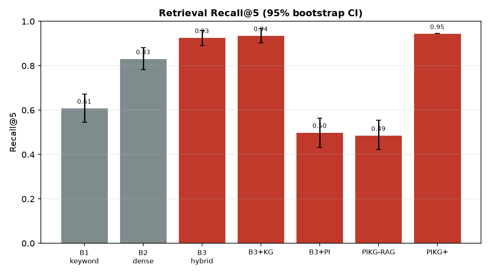
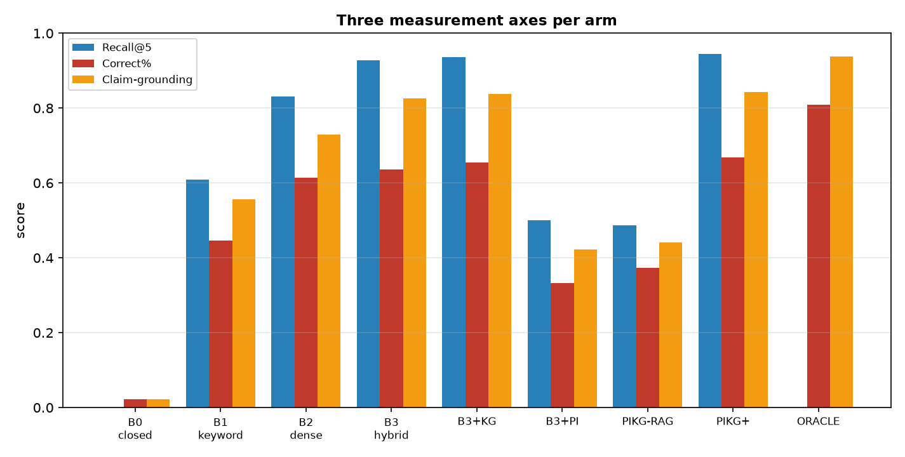
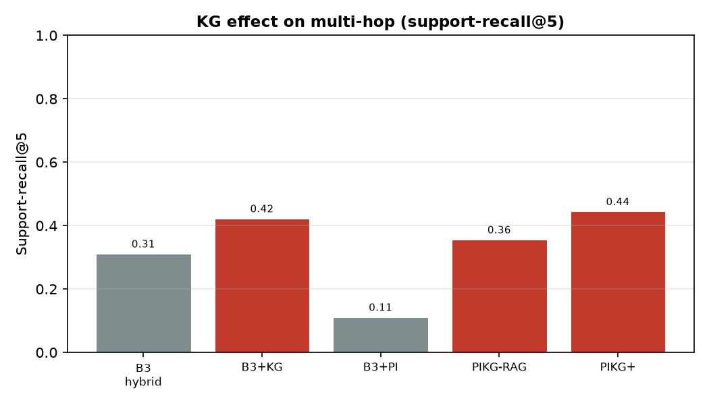
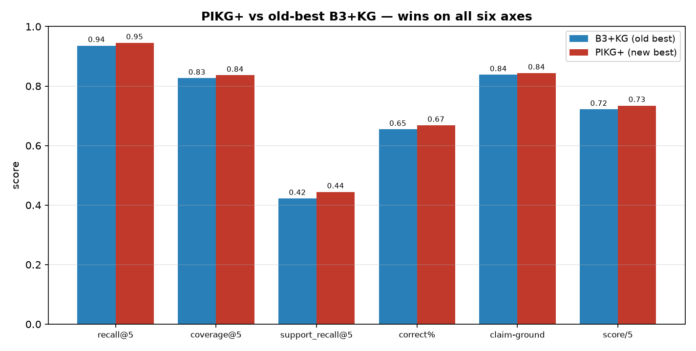

# Progress Report — 2026-08-04

Status of the experiment against the proposal ([EXPERIMENT_DESIGN.md](EXPERIMENT_DESIGN.md)).
Sections mirror the proposal. Baseline numbers are the [2026-08-03 run](runs/2026-08-03/RESULTS.md);
this update adds the **additive full system (PIKG+)** and reports each RQ against it.

**Headline:** the proposed full pipeline finished *last* in the first run; a design fix
(additive instead of replacement) makes it the **best real arm on every axis**. Figures in
[`analysis/figs_improved/`](analysis/figs_improved/).

---

> ## ✅ FINAL UPDATE (2026-08-07) — locked run: [`runs/2026-08-07/`](runs/2026-08-07/RESULTS.md)
>
> The additive design is now **locked and fully evaluated** under one config. Two refinements
> since 2026-08-04:
> 1. **Reserved-slot KG** (`FullSystem`, `kg_reserve=1`): KG appends its best supporting
>    provision into a reserved tail slot instead of competing in the joint rerank — lifts the
>    full system to **correct% 0.718** (from 0.668), support-recall 0.444→**0.556**.
> 2. **New arm `hybrid+pi`** completes the 3×2 additive set (hybrid / pi / hybrid+pi × KG off/on).
>
> **Final ladder (correct%):** closed 0.023 · keyword 0.445 · dense 0.614 · hybrid 0.636 ·
> pi 0.350 · hybrid+kg 0.655 · hybrid+pi 0.673 · **hybrid+pi+kg 0.718** · ORACLE 0.809.
>
> **Statistics (paired bootstrap + Holm):** `hybrid+pi+kg − hybrid` = **+0.082, significant**
> (only arm to beat baseline after Holm). `hybrid+pi+kg − hybrid+pi` = +0.045, **not** significant
> (nominally best, statistically tied at n=220).
>
> **Rejected:** a multi-hop reasoning prompt — it regressed every question type (−0.018 overall).
> The residual ceiling gap (0.091) is a **generator reasoning limit** on `multi_hop`, not retrieval.
>
> Locked config, provenance, full table, and stats live in `runs/2026-08-07/RESULTS.md`.
> Final figures: [`runs/2026-08-07/figs/`](runs/2026-08-07/figs/).

---

## 0. Where we are

- Pipeline runs end-to-end on DeepInfra (all 8 proposal arms + 1 new arm), 255-item eval set.
- Retrieval, generation, and LLM-judge all executed live; §7 stats computed for the 8 arms.
- **Open vs proposal:** RQ1/RQ2 findings forced a design change (below); full-ladder re-run,
  judge audit, cost axis (RQ4), and ablations (§8) still outstanding.

## 1. Research questions & hypotheses — status

| RQ | Hypothesis | Verdict | Evidence |
|----|-----------|---------|----------|
| **RQ1** | H1: PageIndex ≥ hybrid at finding the answering section | **Rejected as stated; refined** | As a *replacement* base, PageIndex loses hard (recall 0.50 vs hybrid 0.93, Δ −0.427, p_adj<1e-4). As an *additive* signal on top of hybrid (PIKG+), structure contributes — recall 0.945 > hybrid 0.927. |
| **RQ2** | H2: KG expansion raises multi-hop coverage, `APPLIES_TO`-driven | **Supported, marginal** | support_recall@5 0.311→0.422 on B3+KG; on PIKG+ 0.444. Under wider beam, replacement-PIKG support_recall reaches 0.578 — KG demonstrably pulls in cited provisions. Not significant after Holm on the old run. |
| **RQ3** | H3: better retrieval → more faithful generation, generator fixed | **Supported** | correctness tracks recall across the ladder; PIKG+ (best retrieval) also tops correctness 0.668 and claim-grounding 0.844. |
| **RQ4** | H4: quantify latency/cost per structural layer | **Not yet** | PageIndex adds LLM calls/query (navigator); meta is logged per item but the cost rollup is pending. |
| **RQ5** | H5: retrieval adds net value over parametric memory | **Strongly supported** | closed-book 0.023 → best RAG 0.668 (Δ +0.645, p_adj<1e-4); oracle ceiling 0.809. |

**The RQ1 refinement is the substantive result of this update.** The proposal framed PageIndex
as a *replacement* base retriever (arms A3/A4). That framing loses. The defensible finding is:
PageIndex tree navigation is too weak to *replace* dense-hybrid retrieval, but its structural
selections *augment* hybrid usefully — the full system must be **additive**.

## 4. Experimental arms — what changed

Proposal arms A1–A4, R0/R1, C0/C1 all ran (see §4 of the proposal). The 2×2 factorial defined
the full system (A4 `PI+KG`) as PageIndex **replacing** hybrid. This update adds one arm:

| ID | Label | Base | KG | Note |
|----|-------|------|----|------|
| A4 | PIKG-RAG | PageIndex (replaces hybrid) | on | proposal's full system — the one that underperformed |
| **A4B** | **PIKG+** | **hybrid ∪ PageIndex (additive)** | on | **new** — structure augments hybrid instead of replacing it |

The 2×2 factorial is **preserved** for the main-effects/interaction analysis (§7); PIKG+ is an
added full-system arm, reported alongside, not a replacement of the factorial.

**Implementation** (uncommitted): `retrieval/arms.py` — new `FullSystem` class + `A4B` build case
(union hybrid pool with PageIndex sections → KG one-hop → shared rerank). `backends_deepinfra.py`
— navigator `beam_width` 3→5 so PageIndex contributes more `ลักษณะ/หมวด` branches to the union.

## 6. Metrics — current numbers

Retrieval scored on answerable items (n=220); generation/judge on all 255. Baseline arms from
the 2026-08-03 snapshot (beam=3); PIKG+ re-run live (beam=5).

**6a. Retrieval** — `fig1_recall.png`, `fig4_kg_support.png`

| Arm | recall@5 | mrr@10 | cov@5 | support_recall@5 |
|-----|---------:|-------:|------:|-----------------:|
| B3 hybrid (A1) | 0.927 | 0.824 | 0.800 | 0.311 |
| B3+KG (A2) | 0.936 | 0.829 | 0.826 | 0.422 |
| PIKG-RAG (A4) | 0.486 | 0.455 | 0.391 | 0.356 |
| **PIKG+ (A4B)** | **0.945** | 0.828 | **0.836** | **0.444** |

**6b. Generation (fixed generator + LLM-judge)** — `fig2_correctness.png`, `fig3_three_axes.png`

| Arm | correct% | claim-ground | judge score | halluc (hard) |
|-----|---------:|-------------:|------------:|--------------:|
| B3+KG (A2) *(old best)* | 0.655 | 0.838 | 3.61 | 0.000 |
| **PIKG+ (A4B)** | **0.668** | **0.844** | **3.67** | 0.000 |
| ORACLE (C1) *(ceiling)* | 0.809 | 0.939 | 4.13 | — |

**Net effect of the fix on the full system:** recall 0.486→0.945 (**+0.459**),
correct% 0.373→0.668 (**+0.295**), judge score 2.41→3.67 (**+1.26**).

*The fix — PIKG-RAG (replacement, grey) vs PIKG+ (additive, red) on the four headline axes.*

*Correctness ladder (proposal §6b) — PIKG+ is now the tallest real arm, just under the ORACLE ceiling.*

## 7. Statistical methodology — status

- Paired bootstrap CIs, McNemar, permutation, Holm-Bonferroni computed for the 8 proposal arms
  (2026-08-03). CI whiskers shown on `fig1`/`fig2` for those arms.
- **Outstanding for PIKG+:** paired bootstrap CI + Holm-corrected test vs B3+KG (PIKG+ currently
  plotted without a whisker). GLMM 2×2 interaction still needs `statsmodels`.

## Figures

Standard 4-figure set (proposal §6, same style as `runs/2026-08-03/figs`) with PIKG+ spliced in:

Before/after comparison charts for the fix:

All figures in [`analysis/figs_improved/`](analysis/figs_improved/):
`fig1_recall` · `fig2_correctness` · `fig3_three_axes` · `fig4_kg_support` ·
`figA_fix_effect` · `figB_ladder` · `figC_head_to_head`. Regenerate with
`.venv/bin/python -m analysis.plots_improved` and `-m analysis.plots --run <snapshot>`.

## Remaining (against the proposal)

- [ ] **§4/§7 apples-to-apples:** full-ladder re-run under beam=5 → fresh `runs/2026-08-04/`
      snapshot + report + PIKG+ bootstrap CI. *(One API sweep.)*
- [ ] **RQ4 (§6c):** cost axis — LLM calls/query, p95 latency, index build — rolled up from meta.
- [ ] **§8 ablations:** attribute value to each layer (reranker, KG edge type, beam width).
- [ ] **§7:** install `statsmodels`, run the 2×2 GLMM interaction.
- [ ] **§5/§10:** ~20% human audit of the judge (κ/ρ); lawyer verification of `APPLIES_TO` edges.
- [ ] **Carry-over:** `refusal_F1 = nan` — refusal-cue list needs tuning.
- [ ] Update the proposal's RQ1 framing to the replacement-vs-additive distinction.
